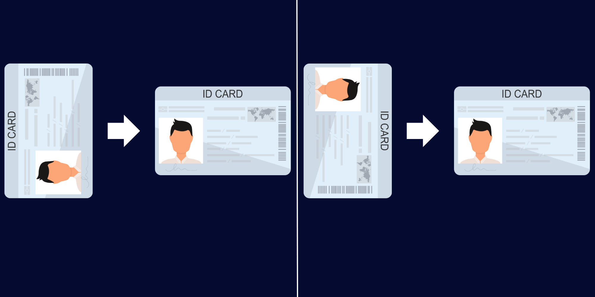

# ID Card Orientation

 

  

<!-- TABLE OF CONTENTS -->

  

  
Table of Contents

  <ol>
    <li>
      <a href="#about-the-project">About The Project</a>
      <ul>
        <li><a href="#built-with">Built With</a></li>
      </ul>
    </li>
    <li><a href="#background">Background</a></li>
    <li><a href="#business-values">Business Values</a></li>
    <li><a href="#how-to-works">How to Works</a></li>
    <li><a href="#dataset">Dataset</a></li>
    <li><a href="#next-step">Next Step</a></li>
    <li><a href="#license">License</a></li>
  </ol>
  

<!-- ABOUT THE PROJECT -->
## About The Project

This project conducts training on the CNN model for orientation on ID cards. This model can rotate ID Card files or images, as in the image below. This model can be a first step to help extract text from ID Cards.

Python libraries, such as Tesseract, can extract text from an image, but the image must be in the correct position to perform optimal extraction. With this model, it will be one of the steps that can be carried out before extracting text from images to get maximum extraction results.

This model uses the efficientnet CNN architecture.

**Note:** This project is still in Jupyter Notebook form. The next step is to carry out the packaging and deploying code process.

  

### Built With

These are list any major frameworks/libraries used to make the project.

* [![Pytorch][Pytorch]][Pytorch-url]

## Background

A company needs customer data for analysis and administration needs. Customer data consists of various forms, including ID Cards. The process of extracting text from images will significantly reduce manual work.

Python libraries such as pytesseract can extract text from an image, but the image must be in the correct position to perform optimal extraction. With this model, it will be one of the steps that can be carried out before extracting text from images to get maximum extraction results.

## Business Values
- Reduce manual work.
- It makes it easier to collect data.

## How to Works
This model classifies ID card images according to orientation angles (90, 180, 270, 360). Then, based on the image label, we can carry out orientation using the OpenCV library.

## Dataset
The dataset consists of training, validating, and testing datasets. Each dataset has an ID card image with an orientation angle of 90, 180, 270, and 360. the orientation angle is the image's label.

## Next Step 
In the next step, we can carry out the packaging and deploying code to be implemented in the production environment.

## License
MIT

(<a href="#automed-forecasting">back to top</a>)

<!-- MARKDOWN LINKS & IMAGES -->
<!-- https://www.markdownguide.org/basic-syntax/#reference-style-links -->
[Pytorch]: https://img.shields.io/badge/PyTorch-EE4C2C?style=for-the-badge&logo=pytorch&logoColor=white
[Pytorch-url]: https://pytorch.org/
